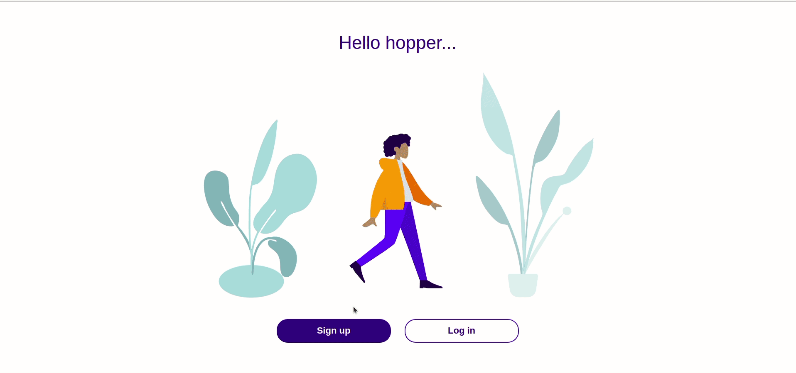
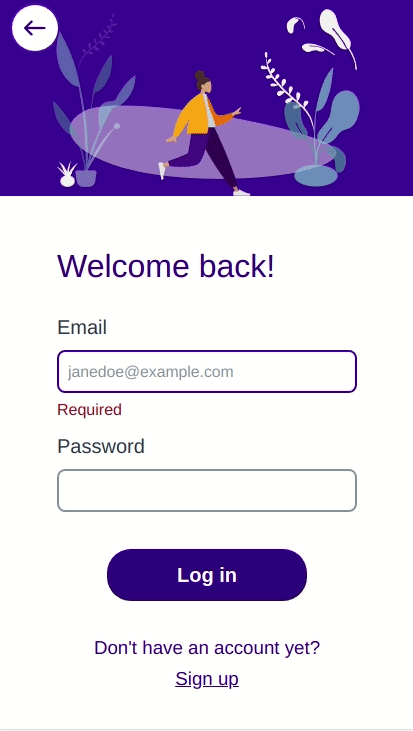
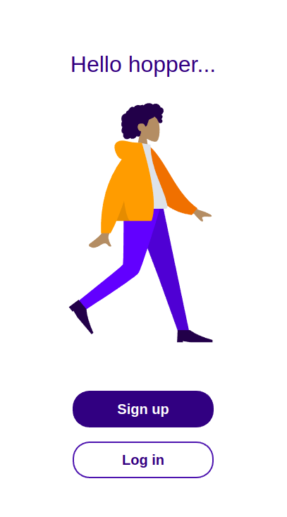
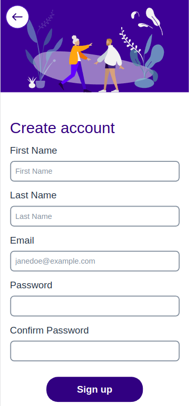
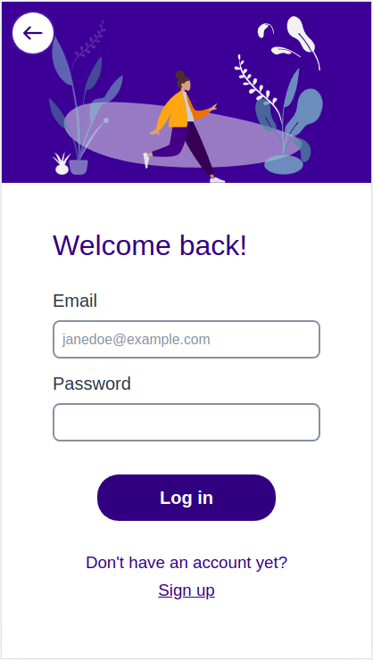
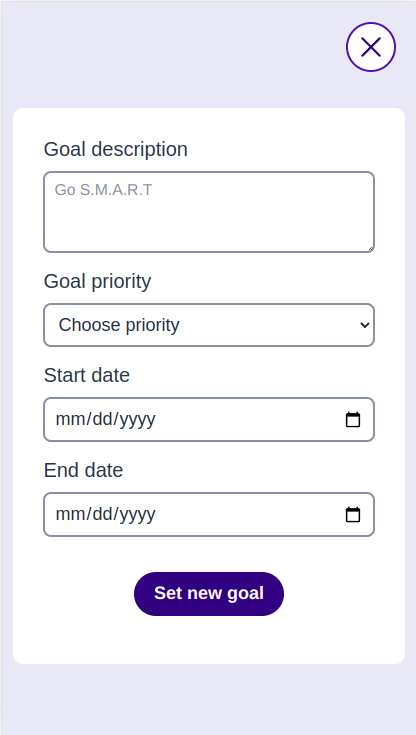
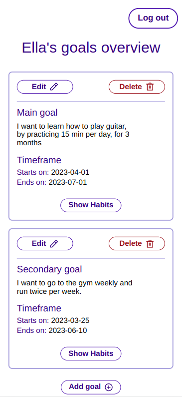

## HabitHop - Description

This is the client side of a responsive, full stack app where users can set goals and add habits they want to build or drop in order to achieve their goals. 

The app has a signup and a login page and users have to make an account in order to use it.

Users can add, edit and delete goals and habits. For each habit they will choose their preferred units of measurement. Stats showing progress in reducing or building the frequency of the tracked habits will be available. Users will also see the time laps from the start of the goal until the chosen deadline.

Users will be able to edit their user data and change a forgotten password. They will also be able to delete their account and all their information if they want. 

Navigation between pages of the application is possible, and the forms include validation. 

[The app's server can be checked here](https://github.com/alex-alina/server-habit-hop)

**Status: WIP**

Estimated deployment time: end of May.
Demo samples can be seen in the last section.

## Tech stack
- React (hooks)
- Redux
- JavaScript
- Styled components 
- Styled system
- Formik
- Superagent
- Jest
- React Testing Library

## Implemented Features:

- Sign-up / Log-in
- Log out 
- Goals page (a maximum of three goals can be added)
- Add / edit / delete goal
- Form validation

## Current work:

- Testing existing functionality
- Components development: Tooltip, Card, Expandable card
- Features: user profile/settings, add a prompt to confirm user wants to delete goal
- Show / hide password functionality

## Future development and features

- User can add / edit / delete habits for each goal
- Use can add habits they want to build and habits they have but want to drop
- User can fill in data for each habit practiced based on chosen units of measurement
- User can see stats for each habit
- Forgotten password functionality
- Habits screen UI
- Users can see the time lapsed between start and end dates on each goal card
- Components needed for the new screen and functionality
- Refreshing JWT
- Reload page on JWT expiration

## Setup

- The backend server and DB of this project must be running for the app to function correctly. Check how to setup it up [here](https://github.com/alex-alina/server-habit-hop).
- Fork / Clone the repository `https://github.com/alex-alina/habit-hop-client`
- Install the dependencies using `npm install`
- Start the application using `npm run start`

## Motivation

My goal is to work on this project as part of effective practice with building and deploying a full stack app.

## Demo - desktop view

## Demo - mobile view

## License

MIT Licence - Copyright &copy; 2023 - Alina Rusu.
